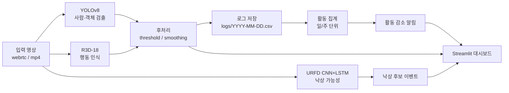
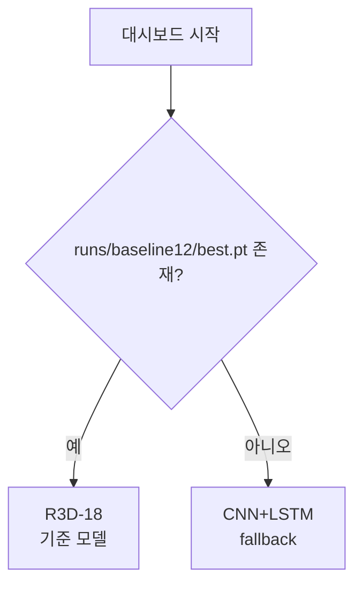

# 고령자 일상행동 모니터링 대시보드

가정용 RGB 영상에서 사람을 검출하고, 일상행동과 낙상 후보를 함께 표시하는
Streamlit 기반 모니터링 시스템입니다. 목표는 고령자의 활동 패턴 변화를
일/주 단위로 확인하고, 장시간 부재·무동작·낙상 후보처럼 보호자가 확인해야 할
상황을 빠르게 보여주는 것입니다.

- **행동 인식**: ETRI 55개 행동을 12개 생활 행동 클래스로 재구성하고 R3D-18로 분류
- **낙상 후보 감지**: URFD로 학습한 CNN+LSTM 모델의 낙상 가능성 사용
- **사람/객체 검출**: YOLOv8 COCO 사전학습 모델 기반 실시간 박스 표시
- **대시보드**: 실시간 webrtc, 영상 업로드 분석, 낙상 클립 저장, 활동 지표, 알림 패널

> 현재 대시보드 기준 행동 인식 모델은 `runs/baseline12/best.pt`의 **R3D-18**입니다.
> 해당 파일이 없으면 CNN+LSTM fallback으로 실행됩니다.

---

## 목차

1. [프로젝트 개요](#1-프로젝트-개요)
2. [결과 요약](#2-결과-요약)
3. [시스템 아키텍처](#3-시스템-아키텍처)
4. [데이터셋과 라벨 설계](#4-데이터셋과-라벨-설계)
5. [모델 구성](#5-모델-구성)
6. [대시보드 구성](#6-대시보드-구성)
7. [설치 및 실행](#7-설치-및-실행)
8. [모델 파일 준비](#8-모델-파일-준비)
9. [평가/학습 명령어](#9-평가학습-명령어)
10. [프로젝트 구조](#10-프로젝트-구조)
11. [한계와 향후 개선](#11-한계와-향후-개선)
12. [팀원 및 역할](#12-팀원-및-역할)

---

## 1. 프로젝트 개요

고령자 돌봄 환경에서는 단순한 실시간 감시보다 “평소와 다른 활동 패턴을
알아차리는 것”이 중요합니다. 이 프로젝트는 RGB 영상만으로 다음 흐름을 구현합니다.

1. 웹캠 또는 업로드 영상 입력
2. YOLOv8로 사람/주요 객체 검출
3. R3D-18로 생활 행동 분류
4. URFD 낙상 모델로 낙상 가능성 산출
5. Streamlit 대시보드에서 결과·클립·활동 지표·알림 확인

발표/데모에서는 구현 산출물이 있는 기능만 전면에 노출합니다. 현재 산출물이 없는
CLIP, 추적(MOTA/IDF1) 같은 항목은 대시보드 지표 탭에서 제외했습니다.

---

## 2. 결과 요약

### 행동 인식 성능

동일한 cross-subject split에서 12개 생활 행동 클래스를 비교했습니다.
Test subject는 `P02/P09/P14`, seed는 42입니다.

| 모델 | 입력 | test acc | macro-F1 | 비고 |
|---|---|---:|---:|---|
| **R3D-18** | RGB clip | **0.693** | **0.603** | 대시보드 기준 모델 |
| skeleton-LSTM | Kinect 25관절 | 0.369 | 0.337 | 관절 입력 필요 |
| CNN+LSTM | RGB frame feature | 0.253 | 0.190 | fallback |
| CNN+YOLO+LSTM | RGB feature + YOLO feature | 0.225 | 0.179 | 비교 실험 |

측정 근거: `runs/baseline12/test_metrics.json`

### 낙상 인식 성능

| 모델 | 데이터 | task | test acc | macro-F1 | 비고 |
|---|---|---|---:|---:|---|
| URFD CNN+LSTM | URFD | fall vs ADL | 0.90 | 0.899 | 대시보드 낙상 신호 |

측정 근거: `runs/urfd_fall/cnn_lstm_result.json`

### 사람 검출

| 항목 | 결과 | 근거 |
|---|---:|---|
| person mAP@0.5 | 0.799 | `runs/baseline12/person_map.json` |

ETRI에는 객체 bounding box GT가 없어 일반 객체 mAP는 산정하지 않았습니다.
검증 가능한 사람 검출, 행동 인식, 낙상 인식만 대시보드 지표로 표시합니다.

---

## 3. 시스템 아키텍처



설계 포인트:

- **실시간성**: YOLO 검출과 행동 인식을 분리해 대시보드 응답성을 유지합니다.
- **후처리**: confidence threshold와 슬라이딩 윈도우 기반 안정화를 사용합니다.
- **재현성**: 학습/평가 split과 주요 산출물 경로를 고정했습니다.
- **데모 안정성**: 네트워크 상태와 무관하게 모델 파일과 샘플 영상을 로컬에 준비하는 것을 권장합니다.

---

## 4. 데이터셋과 라벨 설계

| 데이터셋 | 용도 | 사용 범위 | 출처 |
|---|---|---|---|
| ETRI EPreTX / ETRI-Activity3D | 행동 인식 학습·평가 | P01–P20 RGB/JointCSV | [ETRI EPreTX](https://epretx.etri.re.kr/dataDetail?id=12) |
| URFD | 낙상 모델 학습·평가 | fall 30, ADL 40 | [URFD dataset](https://fenix.ur.edu.pl/~mkepski/ds/uf.html) |
| COCO | YOLO 사전학습 | zero-shot 사용 | Ultralytics YOLOv8 |

### ETRI 55행동 → 12개 생활 행동 클래스

ETRI 원본 55개 행동은 데모와 서비스 해석에 맞게 12개 핵심 클래스로 재구성했습니다.
매핑 파일은 `pipeline/etri_actions.csv`, 클래스 정의는 `pipeline/class_map.py`에 있습니다.

| # | 클래스 | 예시 행동 |
|---|---|---|
| 0 | `eating` | 수저/포크로 먹기 |
| 1 | `drinking` | 물·음료 마시기 |
| 2 | `medicine` | 약 먹기 |
| 3 | `cooking_kitchen` | 냉장고, 조리, 자르기 |
| 4 | `hygiene_grooming` | 양치, 세수, 화장, 옷 입고 벗기 |
| 5 | `housework` | 설거지, 청소, 빨래 |
| 6 | `phone` | 전화 통화, 스마트폰 조작 |
| 7 | `sedentary_screen` | TV, 독서, 글쓰기, 키보드 |
| 8 | `exercise` | 맨손체조, 목/어깨 운동 |
| 9 | `mobility` | 문 열기, 이동, 물건 줍기 |
| 10 | `posture_transition` | 눕기/일어나기 |
| 11 | `other_social` | 대화, 인사, 박수 등 |

학습 시 12클래스 매핑을 켜려면 다음 환경변수를 사용합니다.

```bash
export ETRI_CLASS_MAP=$PWD/pipeline/etri_actions.csv
```

---

## 5. 모델 구성

### 행동 인식

대시보드는 먼저 R3D-18 기준 모델을 로드합니다. 실패하면 동일 인터페이스의 CNN+LSTM
fallback을 사용합니다.



- R3D-18: `pipeline/r3d18_recognizer.py`, `pipeline/action_model.py`
- CNN+LSTM fallback: `pipeline/cnn_lstm_infer.py`
- 클래스 이름: `pipeline/class_map.py`

### 낙상 인식

낙상 신호는 URFD로 학습한 CNN+LSTM 모델의 `fall vs ADL` 확률을 사용합니다.
대시보드에서는 이를 사용자가 이해하기 쉽도록 “낙상 가능성” 또는 `FALL risk`로 표시합니다.

- 기본 모델: `pipeline/urfd_fall_cnnlstm.py`
- 모델 파일: `runs/urfd_fall/cnn_lstm.pt`
- 운영 임계치: `pipeline/config.yaml`의 `fall.urfd_prob_thr`

### 사람/객체 검출

YOLOv8 COCO 사전학습 모델을 사용합니다. ETRI 가정 영상에서는 작은 물체 confidence가
낮아질 수 있어, 대시보드에서는 사람과 신뢰 가능한 큰 객체 중심으로 표시합니다.

- 검출기: `pipeline/detector.py`
- 설정: `pipeline/config.yaml`
- 기본 가중치: `yolov8n.pt`

---

## 6. 대시보드 구성

실행 명령:

```bash
streamlit run app/dashboard.py
```

| 섹션 | 내용 |
|---|---|
| 모델 검증 지표(참고) | 객체 탐지, 행동 인식, 낙상 인식 지표만 표시 |
| 1. 실시간 모니터링 | webrtc 영상에서 YOLO 박스, 행동 라벨, 낙상 가능성 표시 |
| 1a. 저장된 낙상 클립 | 낙상 후보 발생 전후 약 6초 mp4 저장 |
| 1b. 동영상 업로드 분석 | 업로드 영상에 박스/행동/낙상 오버레이 생성 |
| 1c. 경량 활동 지표 | 재실률, 부재, 무동작, 활동량, 구역 체류 계산 |
| 1d. 행동 검출 데모 | validation 샘플에 bbox와 clip-level 행동 태그 표시 |
| 알림 패널 | 로그 기반 활동 감소 알림 표시 |

대시보드의 `p` 같은 내부 확률 표기는 사용자 관점의 “신뢰도”와 “낙상 가능성”으로
바꿨습니다. 데모 화면에서는 의미가 불분명한 약어보다 해석 가능한 라벨을 우선합니다.

---

## 7. 설치 및 실행

### 1) 환경 생성

```bash
conda create -n actiondetect python=3.11 -y
conda activate actiondetect
pip install -r requirements.txt
```

주요 의존성:

- `torch`, `torchvision`
- `ultralytics`
- `streamlit`, `streamlit-webrtc`
- `opencv-python-headless`, `av`
- `pandas`, `plotly`, `pyyaml`

### 2) 데이터 배치

ETRI 데이터는 다음 구조로 배치합니다.

```text
etri/
├── RGB/P01/<session>/A001_P001_*.mp4
└── JointCSV/P01/<session>/A001_P001_*.csv
```

URFD 데이터는 낙상 학습/평가가 필요할 때 다음 구조로 배치합니다.

```text
datasets/fall/urfd/
├── fall/*.mp4
└── adl/*.mp4
```

### 3) 모델 파일 준비

아래 [모델 파일 준비](#8-모델-파일-준비)를 참고해 필요한 모델 파일을 배치합니다.
데모 환경에서는 `runs/baseline12/best.pt`를 미리 준비하는 것을 권장합니다.

### 4) 대시보드 실행

```bash
streamlit run app/dashboard.py
```

단순 YOLO 박스 뷰어만 실행하려면 다음 명령을 사용합니다.

```bash
streamlit run app/run.py
```

---

## 8. 모델 파일 준비

| 파일 | 용도 | 준비 방법 |
|---|---|---|
| `runs/baseline12/best.pt` | R3D-18 기준 행동 인식기 | 공유 저장소에서 다운로드하거나 학습으로 생성 |
| `runs/baseline12/cnn_lstm.pt` | 행동 인식 fallback | 저장소 포함 또는 재학습 |
| `runs/urfd_fall/cnn_lstm.pt` | URFD 낙상 인식기 | 저장소 포함 또는 재학습 |
| `yolov8n.pt` | YOLOv8 검출기 | 로컬 배치 또는 Ultralytics 자동 다운로드 |

R3D-18 기준 모델을 외부 저장소에서 받는 경우:

```bash
mkdir -p runs/baseline12
curl -L "https://drive.usercontent.google.com/download?id=1GRkD-maXmrRjy8Uh80sfYqN21gqFROi3&export=download&confirm=t" -o runs/baseline12/best.pt
ls -lh runs/baseline12/best.pt
file runs/baseline12/best.pt
```

`best.pt`가 없으면 대시보드는 CNN+LSTM fallback으로 실행됩니다. 기능 확인은 가능하지만,
README의 기준 성능 수치와 동일한 모델 데모는 아닙니다.

---

## 9. 평가/학습 명령어

### 테스트

```bash
PYTHONPATH=. python -m pytest -q
PYTHONPATH=. python -m pytest -m unit -q
PYTHONPATH=. python -m pytest -m smoke -q
```

### 행동 인식 R3D-18 학습/평가

```bash
export ETRI_CLASS_MAP=$PWD/pipeline/etri_actions.csv
python src/train.py --config configs/p1_12class.yaml
python src/eval.py --checkpoint runs/baseline12/best.pt --split test
```

### 비교 모델 학습

```bash
PYTHONPATH=. python -m experiments.lstm
PYTHONPATH=. python -m experiments.cnn_lstm
PYTHONPATH=. python -m experiments.cnn_yolo_lstm
```

### 검출 평가와 벤치마크

```bash
PYTHONPATH=. python -m pipeline.eval_person_map
PYTHONPATH=. python -m pipeline.object_conf_scan
PYTHONPATH=. python -m pipeline.bench_e2e
```

### URFD 낙상 모델 학습

```bash
python experiments/urfd_fall/train_urfd_cnnlstm.py \
    --config experiments/urfd_fall/config.yaml
```

---

## 10. 프로젝트 구조

```text
app/
├── dashboard.py              # Streamlit 대시보드
└── run.py                    # 단순 YOLO 뷰어

pipeline/
├── detector.py               # YOLOv8 검출
├── r3d18_recognizer.py       # R3D-18 행동 인식 어댑터
├── cnn_lstm_infer.py         # CNN+LSTM fallback
├── urfd_fall_cnnlstm.py      # URFD 낙상 인식기
├── class_map.py              # 12클래스 매핑
├── aggregate.py / alerts.py  # 로그 집계와 알림
└── config.yaml               # 대시보드/모델 설정

src/
├── train.py / eval.py        # 행동 인식 학습/평가
├── dataset.py                # ETRI 로더
└── model.py                  # R3D-18 기반 모델

experiments/                  # 비교 모델과 URFD 학습 스크립트
runs/                         # 학습 결과, 평가 지표, 데모 산출물
logs/                         # 대시보드 로그 CSV
```

주요 산출물:

- `runs/baseline12/test_metrics.json`: R3D-18 행동 인식 평가
- `runs/baseline12/person_map.json`: 사람 검출 평가
- `runs/urfd_fall/cnn_lstm_result.json`: URFD 낙상 모델 평가
- `runs/fall_clips/`: 실시간 낙상 후보 클립
- `runs/fall_demos/`: 낙상 데모 영상

---

## 11. 한계와 향후 개선

- **낙상 일반화**: URFD는 실험실 환경 데이터이므로 실제 가정 영상에 대한 추가 검증이 필요합니다.
- **행동 검출 vs 행동 분류**: 현재는 클립 단위 행동 분류입니다. 시공간 행동 검출은 별도 GT와 모델이 필요합니다.
- **객체 검출 평가**: ETRI에는 객체 bbox GT가 없어 일반 객체 mAP를 산정하지 않았습니다.
- **단일 사용자 가정**: RGB만으로 신원 재식별을 수행하지 않으므로 `subject_id`는 고정값으로 기록합니다.
- **프라이버시**: 기본적으로 메타데이터 로그 중심이며, 원본 영상 저장은 낙상 후보 클립처럼 명시된 기능에 한정합니다.

향후 개선 방향:

1. 실제 가정 환경 낙상/비낙상 데이터로 임계치 재검증
2. 더 안정적인 bbox smoothing 또는 간단한 tracking 추가
3. 모델 다운로드 링크와 시연용 샘플 영상 경로 확정
4. 팀원별 역할과 재현성 체크 결과 기입

---

## 12. 팀원 및 역할

제출 전 실제 팀원명과 역할을 기입합니다.

| 이름 | 역할 | 주요 기여 |
|---|---|---|
| 신채원 | 데이터/학습 | ETRI 전처리, 12클래스 매핑, R3D-18 학습/평가 |
| 조수연,신채원 | 대시보드/통합 | Streamlit UI, YOLO/행동/낙상 통합, 데모 안정화 |
| 조수연 | 실험/문서 | 비교 모델, URFD 낙상 실험, README/발표 자료 정리 |

---

## 참고 자료

- `PLAN.md`: 프로젝트 내부 의사결정과 실험 계획
